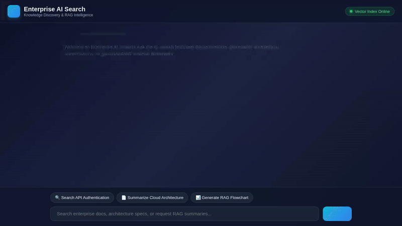

# NexusSearch Enterprise AI — Autonomous Cross-System Intelligence

[](https://ai.google.dev/)
[](https://github.com/google/adk)
[](https://github.com/google/a2ui)
[](https://fastapi.tiangolo.com/)

**NexusSearch Enterprise AI** is an enterprise-grade autonomous cross-system intelligence agent built with **Google ADK (Agent Development Kit)**, **Gemini 2.5 Flash**, **Vertex AI**, and **FastAPI**. It breaks down data silos by autonomously routing, querying, and synthesizing real-time data across 5 enterprise microservice domains: E-Commerce Orders, Supply Chain Logistics, Salesforce CRM 360, SAP ERP Finance, and Workday HR & ServiceNow IT Directories.



---

## 🌟 Resume Highlights & Technical Architecture

- **Multi-Domain Autonomous Routing**: Intelligent LLM routing agent that dynamically determines tool invocations across 5 isolated enterprise databases.
- **Glassmorphic Enterprise Dashboard**: Modern UI with a dedicated system sidebar, live microservice uptime monitoring (<84ms latency), active domain filtering (`ALL_SYSTEMS`, `SUPPLY_CHAIN`, `ECOMMERCE`, `CRM`, `FINANCE`, `HR_IT`), and interactive prompt chips.
- **Interactive A2UI Card Renderer**: Generates native A2UI display cards with actionable buttons (`[📦 Track Live Route]`, `[💳 SAP Invoice PDF]`, `[👤 Escalate Lead]`) that trigger real-time backend audit events.
- **Cross-System Crisis Resolution**: Solves multi-system operational bottlenecks (e.g., Dallas SKU shortages) by identifying impacted orders, CRM account owners, SAP payment holds, and HR escalation leads in a single query.
- **GenAI Architecture Diagram Generator**: Dynamically generates system architecture flowcharts using Vertex AI Imagen 3.

---

## 🏗 System Architecture & Microservice Integration

```
                 +-------------------------------------------------+
                 |  NexusSearch Glassmorphic Dark Dashboard UI     |
                 +-----------------------+-------------------------+
                                         |
                                (HTTP / A2A Protocol)
                                         v
                 +-------------------------------------------------+
                 |       FastAPI Proxy Server (main.py)           |
                 +-----------------------+-------------------------+
                                         |
                                         v
                 +-------------------------------------------------+
                 |   Google ADK LlmAgent (Gemini 2.5 Flash Engine) |
                 +----+---------------+---------------+-------+----+
                      |               |               |       |
      +---------------+   +-----------+---+   +-------+---+   +---------------+
      |                   |               |               |                   |
      v                   v               v               v                   v
+-------------+    +-------------+  +-----------+   +-----------+    +-----------------+
|📦 Logistics |    |🛒 E-Commerce|  |👥 CRM 360 |   |💳 SAP ERP |    |💻 Workday /     |
|   (FedEx/   |    |  (Orders &  |  | (Accounts |   | (Finance  |    |  ServiceNow IT  |
|  Warehouse) |    | Line Items) |  |  & ARR)   |   | & Invoices|    |   Directory     |
+-------------+    +-------------+  +-----------+   +-----------+    +-----------------+
```

---

## 🚀 Quickstart & Setup Guide

### 1. Prerequisites
- Python 3.10+
- `uv` package manager (`pip install uv`)

### 2. Installation
```bash
git clone https://github.com/arun-kranthi/buildwithgemini-ai-search-agent.git
cd buildwithgemini-ai-search-agent
uv sync
```

### 3. Launching Local Server
```bash
cd frontend
PORT=8081 uv run python main.py
```

Open `http://localhost:8081` in your browser to interact with the NexusSearch Dashboard.

---

## 🛠 Tech Stack

- **AI & Agent Orchestration**: Google Agent Development Kit (ADK), Gemini 2.5 Flash, Vertex AI Imagen 3
- **Protocol & Formats**: Agent-to-Agent (A2A) Protocol, A2UI (Agent-to-User Interface v0.8)
- **Backend & Proxy**: FastAPI, Uvicorn, Pydantic, Python 3.13
- **Frontend & Styling**: Vanilla HTML5/CSS3 (Glassmorphism, CSS Variables, Micro-animations), Material Symbols, Google Fonts
- **Automation & Testing**: Playwright Async, ImageIO / PIL
